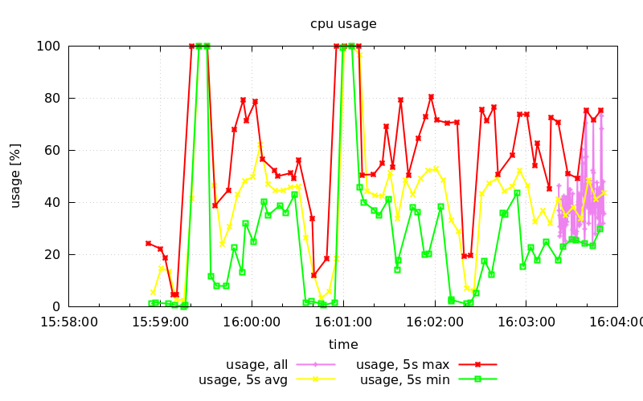
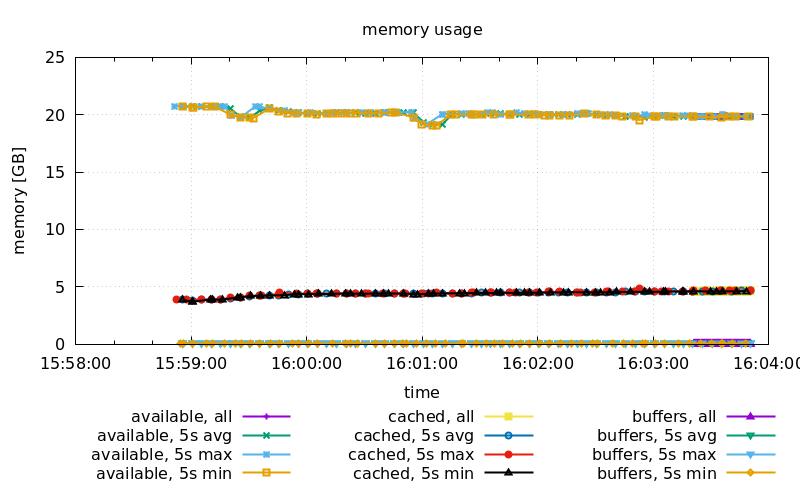

# librrd
Round Robin Database Library

## Overview
This is a very simple library for a Round Robin Database (RRD).
It is neither compatible with nor intended as a replacement for RRDtool.
However librrd is designed to work in a quite similar way.
You can create multiple round robin archives (RRA).
Each archive holds either raw or aggregated data, up to a fixed number of
archive entries.
Raw data represents primary data points (PDPs).
Multiple primary data points can be transformed into aggregated data by using a
specified consolidation function (minimum, maximum or average).
This allows to use raw data points for covering recent periods of time and
aggregated data points for covering older, larger periods of time.
Each RRA, where aggregated data points are stored, has a fixed size, depending
on the specified row count.
Consequently there will be an upper limit for how large your round robin
database can grow.

## Example
librrd comes with a small example.
It can be compiled by running `make example`.
The example will measure CPU and memory usage each second for one minute.
It uses one RRA for each type, storing raw data (primary data points) for up to
30 seconds.
To cover longer periods, several other RRAs are created to store minimum,
maximum and average values.
These other RRAs aggregate multiple raw data points into one single archive
entry, every five seconds, resulting in a total of 12 RRA entries.

After running the example, you can use the command `gnuplot example.plot` to
plot the RRAs.

## Debugging

Debug builds and debug log messages can be enabled by passing appropriate flags to `make`:
`CPPFLAGS="-DDEBUG" CXXFLAGS="-g" make`

## License
[GNU Lesser General Public License v3.0](https://www.gnu.org/licenses/lgpl-3.0.txt)
(c) Alexander Heinlein
